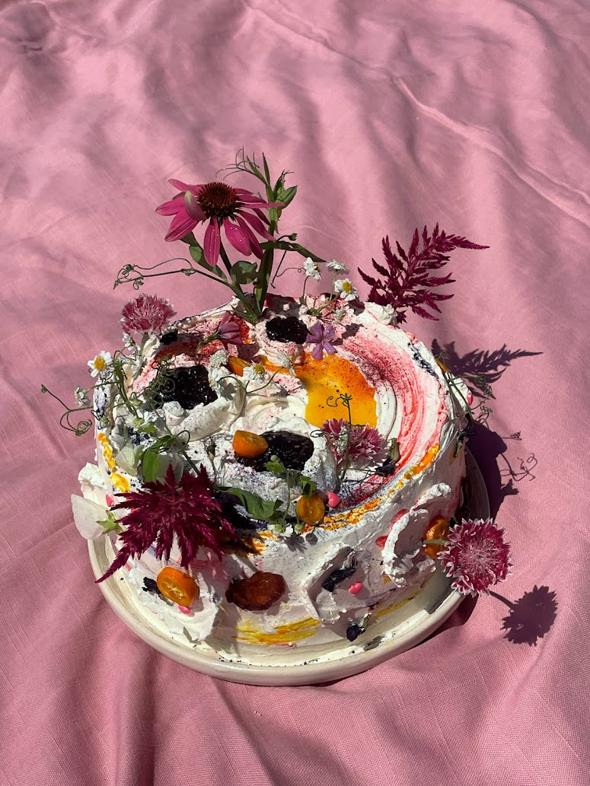
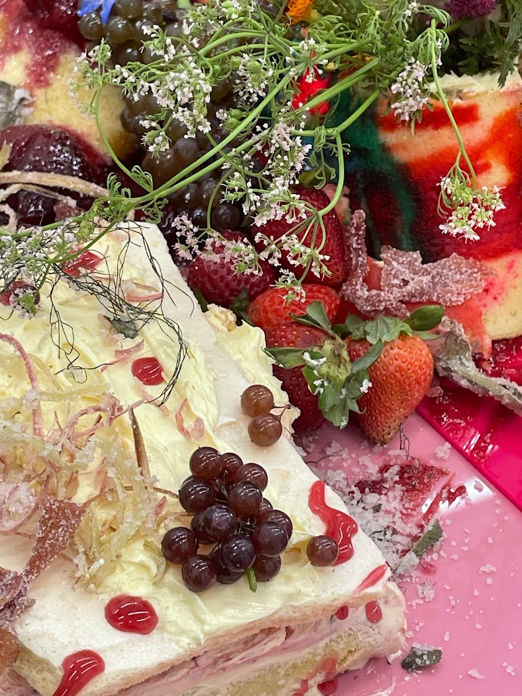
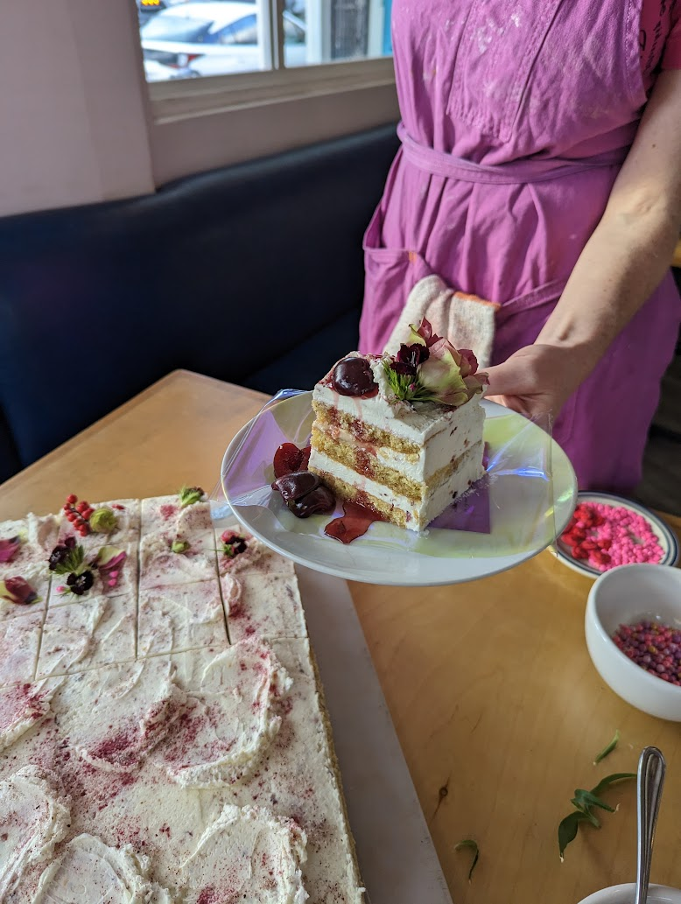
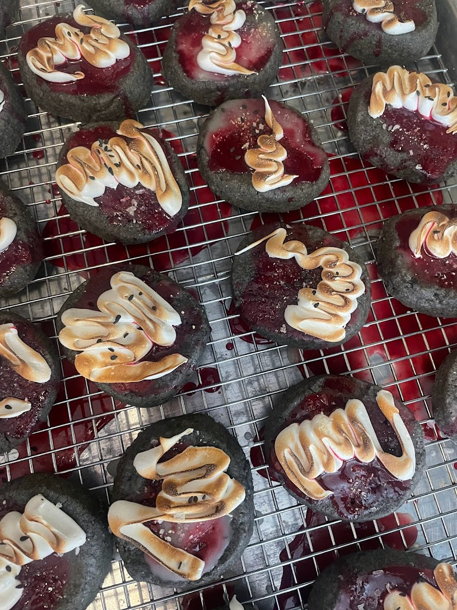
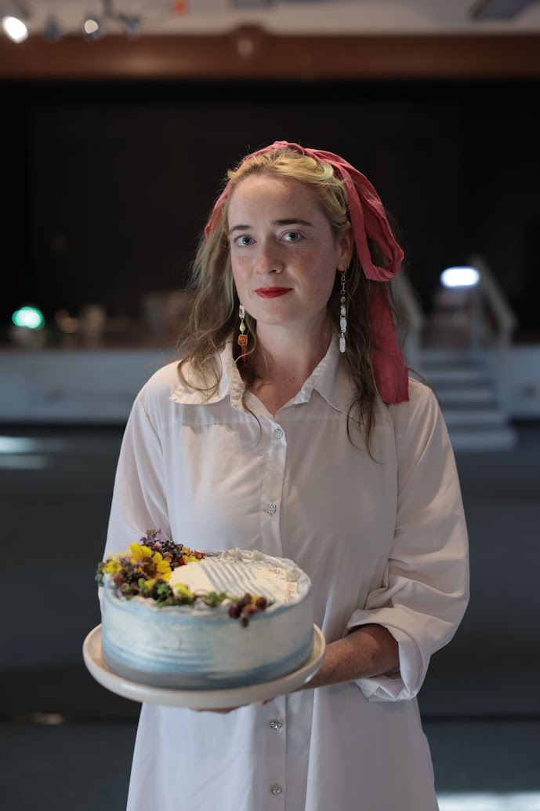

I'm an artist and researcher, based in Los Angeles. As a researcher, I work with/in social movement spaces to further projects of collective liberation. Most recently, I worked as Research Director for [Where Is My Land](https://whereismyland.org/), an organization that seeks restitution for Black families who have experienced land dispossession within their lineage. Previously, I have supported groups such as the [Solidarity Research Center](https://solidarityresearch.org/project/municipalism-a-critical-review/), [CodePink](https://www.codepink.org/), the [Garment Workers Center](https://garmentworkercenter.org/), [Youth Justice Coalition](https://youthjusticela.org/), [Downtown Crenshaw](https://downtowncrenshaw.com/), The [UCLA Luskin Institute on Inequality and Democracy](https://challengeinequality.luskin.ucla.edu/), and [SWAN Vancouver](https://swanvancouver.ca/). I'm currently working on a movement research guide (coming soon!) and will be leading a workshop on movement research at [DeepMay](https://deepmay.net/) in August.

My artistic practice is always stretching and folding. Sometimes I make things with words, sometimes with flour, sometimes with code or sound or strangers in a park. Each offering is an invitation: to play, gather, and imagine new ways of being together. From 2017-2019, I co-led a social practice and creative placemaking collective alongside El Arkin and Renee Miles Rooijmans, called frida&frank. We designed and fabricated our own ping-pong tables and played hundreds of games with strangers across greater Vancouver as an invitation to reimagine public spaces. More recently, I've been a part of an alternative education project based in Los Angeles, called [F.R.A.C.T.A.L.](https://fractal.school/). I'm also a culinary artist, with a sweet spot for cakes. My favourite cakes I've made are ones that act as an ephemeral archive. Sometimes my cakes are more sculptural, sometimes they're digital. Sometimes I make wedding cakes and desserts for events, like pop-ups and book releases. Sometimes the cakes are grief rituals and poems. Some times I write about them! [Check out my guide to baking cakes here.](#) I also do food styling. I make food other than cakes too! More than anything, I  love to play <video src="images/linked-images/play.mp4" class="hover-img" loop playsinline></video> :). My culinary project, as well as my DJing are nestled under the moniker 'Lovening Agent'.

Lately, my creative practice has been merging with my collaborator and partner, [Whisper](https://hyperwhisper.net/), building  software, hardware, and wetware (ritual) for collective home-making. [Check out our website here!](https://resonant.love) We're about to head off on a whorld tour at the end of July and will be frolicking across North America and Europe. We love to meet people and also [read together](https://spines.resonant.love) — Come join us for [office hours](https://resonant.love/office-hours.html), or send us an email at **hwwh at resonant dot love** to connect!

find me on: [Instagram](https://www.instagram.com/lovening.agent/) ♡ [SoundCloud](https://soundcloud.com/lovening-agent) ♡ [Are.na](https://www.are.na/halllllllllllllllllllllllllllllllllllll-3/channels) ♡ [GitHub](https://github.com/fluffypuffyfluffy)
